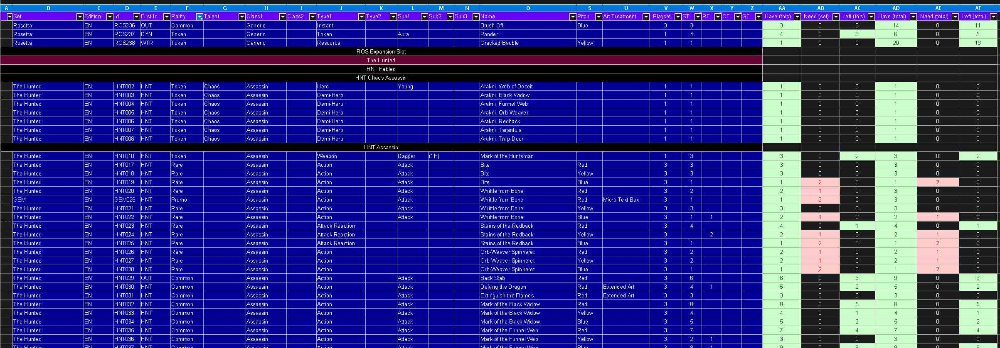
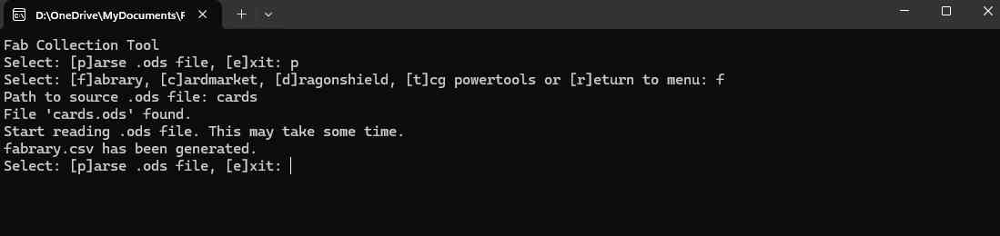

# Fab Collection Tool

Manage your collection in an Open Document Spreadsheet (ODS).  
Then export the ODS contents to your favorite collection manager.

## Why?
You can manage your collection independent of any website or tool in a common Excel / LibreOffice ODS file.  
One single source of your cards for all common other tools like Fabrary, Cardmarket or Dragonshield.  
It can be extended for other tools in the future, easily.  
It is easy to add new cards with keyboard only. Very simple and comfortable editing.  
You can use standard filters and search to view the data as you need it.  
Import your collection fast to Fabrary or other collection tools.

## Examples

### ODS file

### Parser

## How to

You'll find an example ODS file in the docs folder.  
This is an example how to edit it.  
Names of the cards and their IDs must match the names and IDs given 
by Legend Story Studios (LSS).  
All rights belong to Legend Story Studios!  
See https://fabtcg.com/

To create import files for other collection managers, start the 
FabCollectionTool.exe file.

If you're asked for the path to the ODS file, copy path 
including file and file extension.  
Example: D:\Projects\FabCollectionTool\docs\example.ods

If you have copied the ODS file into the same directory as the 
FabCollectionTool.exe file, you can also just give the filename including extension.  
Example: example.ods

Follow the dialogs.

Afterwards you should find a file in the FabCollectionTool.exe folder according to your 
created export.  
Example: fabrary.csv

File must not be opened in another process when importing.

Have fun ;-)

## Hints

To raise Libre Office Calc performance on Windows while editing, 
turn of "Auto Calculation".

Use "Paste special" and select "All" when copy and paste rows to keep formulars 
and conditional styles.

Conditional styles only work if "Auto Calculation" is enabled.

Only the blue cells are needed to export.  
You may add more cols if you like or delete existing non-blue cols.

Save often, save backups (copies).

### Fabrary

If you miss a card, check if it is set in another way than it should be.  
Check rarity, foil, etc.  
If you didn't find something, download the fabrary collection and compare the concerned  
card in the CSV file.  

I recognized, that "incorrect" defined cards from your ODS are still counted in Fabrary  
but not listed in any of the input fields. Fabrary recognizes that you have a copy but  
can't identify the right input field where it should be listed.