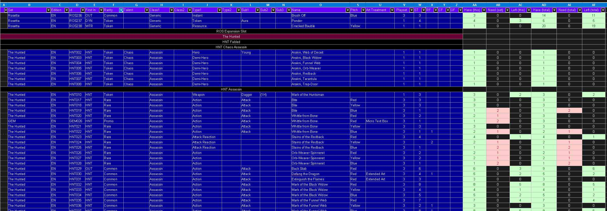
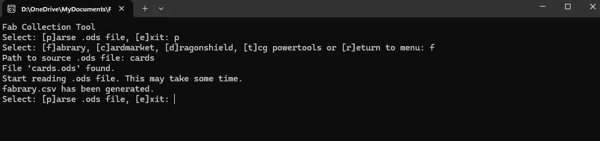

# Fab Collection Tool

## FabCollectionTool 2 – in the browser

The new version runs right in the browser, without installation:
**<https://jazzman1976.github.io/FabCollectionTool/>** (Google Chrome or Microsoft Edge).
Your collection stays a CSV file on your own computer. Source code and German documentation:
[`src/FabCollectionTool2`](src/FabCollectionTool2/README.md).

## Release Notes (FabCollectionTool 2)

Kurzfassung je veröffentlichter Version, neueste zuerst. Ausführlich mit allen Einzelheiten:
[`src/FabCollectionTool2/RELEASE-NOTES.md`](src/FabCollectionTool2/RELEASE-NOTES.md).
Die Nummern in Klammern sind die Issues.

### 2.7.0 – 03.10.2026
- **Detailspalten nach hinten** (#62): `Edition`, `Language`, `First In` und „Exklusiv“ stehen
  hinter *Left (total)*; Mengen und *Have / Need / Left* sind ohne Scrollen im Bild.
- Geändert: `collection.csv` folgt der neuen Spaltenfolge
  (`Set, Id, Rarity, …, GF, Edition, Language, First In, Note, Overrides`). Bestehende Bestände
  werden über die Spaltennamen gelesen und beim nächsten Speichern umgeschrieben.
- `collection.csv` ist keine Schnittstelle für externe Tools; dafür gibt es die Exporte
  (Fabrary, Cardmarket).

### 2.6.0 – 03.10.2026
- **Neu: Edition und Sprache getrennt** (#53). `Edition` enthält nur noch Alpha, First oder
  Unlimited; die Sprache steht in der neuen Spalte `Language` (EN, DE, …; Standard EN).
  Bestehende Bestände werden beim Öffnen umgestellt. `collection.csv` bekommt dadurch eine
  Spalte mehr (`Set, Edition, Language, Id, …`) – wichtig für externe Tools.
- **Neu: Exklusive Karten** (#54). Spalte „Exklusiv“ und gleichnamiger Schnellfilter für
  Karten, die es nur in einem einzigen Set gibt.
- **`First In` aus den Stammdaten** (#51). Immer gefüllt mit dem Set, in dem die Karte zuerst
  erschien; Reprints sind hervorgehoben. Eigene abweichende Werte bleiben als lokale Änderung
  (✱) erhalten.
- **Tastatur** (#52): Die Liste springt nicht mehr in die Bildmitte, sie scrollt erst am
  oberen oder unteren Rand mit.
- **Werkzeugleiste** (#50): Filter und Gliederung stehen direkt hinter Hilfe, die Tabelle
  bekommt mehr Platz.
- Geändert: Der Cardmarket-Export hängt am Zeilenende keine Sprache mehr an; *Leere Zeilen
  entfernen* erfasst auch EN-Zeilen ohne Menge und Notiz.

### 2.5.0 – 30.09.2026
- **Neu: Details und Reprints in der großen Bildansicht** (#26): Kartendaten, die gezeigte
  Variante mit deinen Mengen und alle Varianten und Reprints der Karte aus allen Sets.
- **Neu:** Shift+→ / Shift+← ändern Mengen wie Shift+↑ / Shift+↓ (#37).
- ← / → beim Bearbeiten wie in Tabellenprogrammen (#39); Farbkennung nur noch im Rechenblock
  (#36); Gruppen-Knöpfe links im Set-Kopf (#38); Cardmarket „Set nicht anhängen“ auch bei
  „fehlend je Set“ (#35).
- Korrigiert: Gruppentitel und Knöpfe bleiben beim waagerechten Scrollen sichtbar (#38).
- Stammdaten: the-fab-cube `develop` auf `18b2d9d` vom 30.09.2026.

### 2.4.0 – 29.09.2026
- **Neu: Set-Gruppen gemeinsam auf- und zuklappen** (#27) mit ⊞ / ⊟ im Set-Kopf oder
  Shift+→ / Shift+←.
- Leere Felder, die von den Stammdaten abweichen, zeigen „[leer]“ (#25).
- Versionsnummer ab jetzt dreistellig: *Major.Minor.Release*.

### 2.3.1.0 – 29.09.2026
- Hotfix: Die GitHub Action hatte 2.3.0.0 nicht veröffentlicht, weil der Selbsttest einen
  Fabrary-Export brauchte, der nicht im Repository liegt. Die App ist unverändert; diese
  Version enthält alles aus 2.3.0.0.

### 2.3.0.0 – 29.09.2026
- **Neu: Fabrary-Export aus the-fab-cube** (#17): alle Karten, jede Variante in jedem Foiling;
  fehlende Karten stehen mit 0 darin.
- **Neu: Fabrary-Zuordnung** (#17): Wo Fabrary Sets, Treatments oder Identifier anders nennt,
  schreibt der Export Fabrarys Namen; eigene Einträge und Abgleich mit einem Fabrary-Export
  unter *Export → Zuordnung …*.
- **Neu: Sets aufnehmen ohne leere Zeilen** (#18): Varianten stehen zunächst nur grau (○) in
  der Tabelle; *Leere Zeilen entfernen …* räumt vorhandene auf.
- **Neu: Konfigurationsdatei** `<bestand>-config.json` im Arbeitsordner (#18).
- Der Einrichtungsassistent kündigt an, welche Datei als Nächstes gewählt wird (#3).

### 2.2.0.0 – 28.09.2026
- **Neu: Export nach Cardmarket** (#7): Wants-Liste der Karten, die zum Playset fehlen, nach
  Sets und Seltenheiten wählbar.
- **Neu: Pitch-Farben** (#4): farbiger Punkt vor Red, Yellow, Blue und Purple.
- Korrigiert: Pitch „4“ heißt „Purple“; Bestände werden beim Laden umgestellt (#4).

### 2.1.0.0 – 25.09.2026
- Erste öffentliche Version als GitHub Page. Unterstützt wird Chrome (und Edge), Firefox nicht
  mehr.

The rest of this page describes the original tool (version 1).

## FabCollectionTool 1

Manage your collection in an Open Document Spreadsheet (ODS).  
Then export the ODS contents to your favorite collection manager.

## Why?
You can manage your collection independent of any website or tool in a common Excel / LibreOffice ODS file.  
One single source of your cards for all common other tools like Fabrary, Cardmarket or Dragonshield.  
It can be extended for other tools in the future, easily.  
It is easy to add new cards with keyboard only. Very simple and comfortable editing.  
You can use standard filters and search to view the data as you need it.  
Import your collection fast to Fabrary or other collection tools.

## Examples

### ODS file

### Parser

## How to

You'll find an example ODS file in the docs folder.  
This is an example how to edit it.  
Names of the cards and their IDs must match the names and IDs given 
by Legend Story Studios (LSS).  
All rights belong to Legend Story Studios!  
See https://fabtcg.com/

To create import files for other collection managers, start the 
FabCollectionTool.exe file.

If you're asked for the path to the ODS file, copy path 
including file and file extension.  
Example: D:\Projects\FabCollectionTool\docs\example.ods

If you have copied the ODS file into the same directory as the 
FabCollectionTool.exe file, you can also just give the filename including extension.  
Example: example.ods

Follow the dialogs.

Afterwards you should find a file in the FabCollectionTool.exe folder according to your 
created export.  
Example: fabrary.csv

File must not be opened in another process when importing.

Have fun ;-)

## Hints

To raise Libre Office Calc performance on Windows while editing, 
turn of "Auto Calculation".

Use "Paste special" and select "All" when copy and paste rows to keep formulars 
and conditional styles.

Conditional styles only work if "Auto Calculation" is enabled.

Only the blue cells are needed to export.  
You may add more cols if you like or delete existing non-blue cols.

Save often, save backups (copies).

### Fabrary

If you miss a card, check if it is set in another way than it should be.  
Check rarity, foil, etc.  
If you didn't find something, download the fabrary collection and compare the concerned  
card in the CSV file.  

I recognized, that "incorrect" defined cards from your ODS are still counted in Fabrary  
but not listed in any of the input fields. Fabrary recognizes that you have a copy but  
can't identify the right input field where it should be listed.